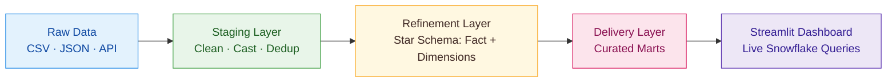

# E-Commerce Analytics Pipeline & Dashboard
End-to-end e-commerce analytics pipeline for Amazon purchase &amp; survey data.
**Analysis of 1.8M Amazon Purchases by 5,000+ U.S. Users**  
📆 2018–2022 | 🔍 Linked Demographics | 💡 Real-World Insights

## Project Summary

The project demonstrates an end-to-end analytics solution using real-world e-commerce data from Amazon, integrating multiple file formats (CSV, JSON), enriching with demographic APIs, and transforming it using Snowflake and dbt. 

## Tech Stack:  

- **Snowflake** – Storage, compute, warehouse orchestration.  
- **dbt** – SQL-based transformations.  
- **Python** – API ingestion, preprocessing.  
- **Streamlit** – Interactive dashboard UI.  
- **GitHub** – Version control & collaboration.

---

## Data Sources

| Dataset | Description |
|--------|-------------|
| `amazon-purchases.csv` | 1.85M orders (2018–2024) |
| `survey.csv` | User demographics |
| `fields.csv` | Metadata |
| U.S. Census API (json) | State income & population (2018–2023) |

## Architecture

---

## 🧱 Layer Breakdown

### **Staging Layer**
| Model | Purpose |
|-------|---------|
| `stg_amazon_purchases` | Cleans and type-casts order data, removes duplicates. |
| `stg_survey` | Normalizes survey fields, sets Hispanic flag boolean. |
| `stg_state_demographics` | Parses ACS JSON payloads into typed columns. |
| `stg_state_codes` | Minimal mapping of postal/state/FIPS. |

---

### **Refinement Layer (Star Schema)**
#### **Fact Table**
- `fct_orders` – Order grain, links all dimensions.

#### **Dimensions**
| Model | Purpose |
|-------|---------|
| `dim_user` | Customer demographics, household & account info. |
| `dim_state` | Canonical state lookup (postal, name, FIPS). |
| `dim_product` | SKU details, gift card flag. |
| `dim_date` | Time dimension for analysis. |
| `dim_state_demographics` | Median income & population by state/year. |

#### **Enriched Orders**
- `ref_orders_enriched` – Joins staging data with demographics and computed metrics.

---

### **Delivery Layer (Marts)**
| Model | Purpose |
|-------|---------|
| `mart_sales_by_state_m_y` | Monthly sales by state. |
| `mart_sales_by_category_m_y` | Monthly sales by category. |
| `mart_customer_segment_metrics` | Revenue by demographic segments. |
| `mart_cohort_retention` | Customer retention over time. |
| `mart_top_products` | Top 50 products by revenue and units. |
| `mart_revenue_by_income_state` | Revenue & order count by income bracket/state. |
| `mart_revenue_vs_income_state_year` | Revenue vs median income per state/year. |

---

## 📊 Dashboard Features
Streamlit app with **5 interactive tabs**:
1. **Sales Overview** – Revenue trends, sales by state/year.  
2. **Category Performance** – Revenue & Avg. Order Value by category.  
3. **Customer Insights** – Revenue by age, income, and other demographics.  
4. **Cohort Analysis** – User retention curves.  
5. **Revenue vs Income** – Correlation between state income & purchasing.  

---

## 📈 Example Business Questions Answered
- Do wealthier states generate more revenue?  
- Are lower-income states showing purchasing growth?  
- How does median household income correlate with revenue?  
- Which product categories drive the highest Avg. Order Value?  
- How does customer retention vary by cohort?  

---

## 🔐 Sensitive Data & Secrets
- All Snowflake credentials are stored in `.env` / `secrets.toml` (not committed to GitHub).
- Example `.env` template is included for safe local setup.

---