# E-Commerce Analytics Pipeline & Dashboard
End-to-end e-commerce analytics pipeline for Amazon purchase &amp; survey data.
**Analysis of 1.8M Amazon Purchases by 5,000+ U.S. Users**  
📆 2018–2022 | 🔍 Linked Demographics | 💡 Real-World Insights

## Project Summary

The project demonstrates an end-to-end analytics solution using real-world e-commerce data from Amazon, integrating multiple file formats (CSV, JSON), enriching with demographic APIs, and transforming it using Snowflake and dbt. 

## Tech Stack:  

- **Snowflake** – Storage, compute, warehouse orchestration.  
- **dbt** – SQL-based transformations.  
- **Python** – API ingestion, preprocessing.  
- **Streamlit** – Interactive dashboard UI.  
- **GitHub** – Version control & collaboration.

---

## Data Sources

This project uses the **Open E-Commerce 1.0** dataset ([Harvard Dataverse link](https://dataverse.harvard.edu/dataset.xhtml?persistentId=doi:10.7910/DVN/YGLYDY)), a first-of-its-kind public dataset containing detailed Amazon.com purchase histories from **5,027 U.S. consumers** between **2018–2022**, totaling over **1.8 million transactions**.  

The dataset was crowdsourced via an online survey, with participants’ informed consent, and links each purchase to rich demographic, lifestyle data.   

Additionally, U.S. Census **American Community Survey (ACS)** data ([data.census.gov](https://data.census.gov/)) is integrated via API to append **state-level median income** and **population** for 2018–2023.  

| Dataset | File Name | Format | Description | Source |
|---------|-----------|--------|-------------|--------|
| Amazon Purchases | `amazon-purchases.csv` | CSV | 1.85M orders with date, product, price, quantity, shipping state | [Harvard Dataverse](https://dataverse.harvard.edu/dataset.xhtml?persistentId=doi:10.7910/DVN/YGLYDY) |
| Survey Data | `survey.csv` | CSV | Demographic, household, income, education, lifestyle data | [Harvard Dataverse](https://dataverse.harvard.edu/dataset.xhtml?persistentId=doi:10.7910/DVN/YGLYDY) |
| Survey Metadata | `fields.csv` | CSV | Column definitions and survey question metadata | [Harvard Dataverse](https://dataverse.harvard.edu/dataset.xhtml?persistentId=doi:10.7910/DVN/YGLYDY) |
| ACS State Demographics | API | JSON | Median household income & population by state/year (2018–2023) | [data.census.gov](https://data.census.gov/) |

## Architecture

```mermaid
flowchart LR
  A["Raw Data<br>CSV · JSON · API"] --> B["Staging Layer<br>Clean · Cast · Dedup"]
  B --> C["Refinement Layer<br>Star Schema: Fact + Dimensions"]
  C --> D["Delivery Layer<br>Curated Marts"]
  D --> E["Streamlit Dashboard<br>Live Snowflake Queries"]

  classDef raw fill:#e3f2fd,stroke:#1e88e5,color:#0d47a1;
  classDef stg fill:#e8f5e9,stroke:#43a047,color:#1b5e20;
  classDef ref fill:#fff8e1,stroke:#f9a825,color:#3e2723;
  classDef del fill:#fce4ec,stroke:#d81b60,color:#880e4f;
  classDef dash fill:#ede7f6,stroke:#5e35b1,color:#311b92;

  class A raw; class B stg; class C ref; class D del; class E dash; 

```

---

## Layer Breakdown

### **Staging Layer**
| Model | Purpose |
|-------|---------|
| `stg_amazon_purchases` | Cleans and type-casts order data, removes duplicates. |
| `stg_survey` | Normalizes survey fields, sets flag boolean. |
| `stg_state_demographics` | Parses ACS JSON payloads into typed columns. |
| `stg_state_codes` | Minimal mapping of postal/state/FIPS. |

---

### **Refinement Layer (Star Schema)**
#### **Fact Table**
- `fct_orders` – Order grain, links all dimensions.

#### **Dimensions**
| Model | Purpose |
|-------|---------|
| `dim_user` | Customer demographics, household & account info. |
| `dim_state` | Canonical state lookup (postal, name, FIPS). |
| `dim_product` | SKU details, gift card flag. |
| `dim_date` | Time dimension for analysis. |
| `dim_state_demographics` | Median income & population by state/year. |

#### **Enriched Orders**
- `ref_orders_enriched` – Joins staging data with demographics and computed metrics.

---

### **Delivery Layer (Marts)**
| Model | Purpose |
|-------|---------|
| `mart_sales_by_state_m_y` | Monthly sales by state. |
| `mart_sales_by_category_m_y` | Monthly sales by category. |
| `mart_customer_segment_metrics` | Revenue by demographic segments. |
| `mart_cohort_retention` | Customer retention over time. |
| `mart_top_products` | Top 50 products by revenue and units. |
| `mart_revenue_by_income_state` | Revenue & order count by income bracket/state. |
| `mart_revenue_vs_income_state_year` | Revenue vs median income per state/year. |

---

## Dashboard Features
Streamlit app with **5 interactive tabs**:
1. **Sales Overview** – Revenue trends, sales by state/year.  
2. **Category Performance** – Revenue & Avg. Order Value by category.  
3. **Customer Insights** – Revenue by age, income, and other demographics.  
4. **Cohort Analysis** – Loyalty tracking over months.  
5. **Revenue vs Income** – Correlation between state income & purchasing.  

---

## Example Business Questions Answered
- Do wealthier states generate more revenue?  
- Are lower-income states showing purchasing growth?  
- How does median household income correlate with revenue?  
- Which product categories drive the highest Avg. Order Value?  
- How does customer retention vary by cohort?  

---

## Sensitive Data & Secrets
- All Snowflake credentials are stored in `.env` / `secrets.toml` (not committed to GitHub).
- Example `.env` template is included for safe local setup.

---

## Full Documentation
For detailed transformation logic, schema tests, and SQL models, see the full PDF in the repo or click [here]() 
